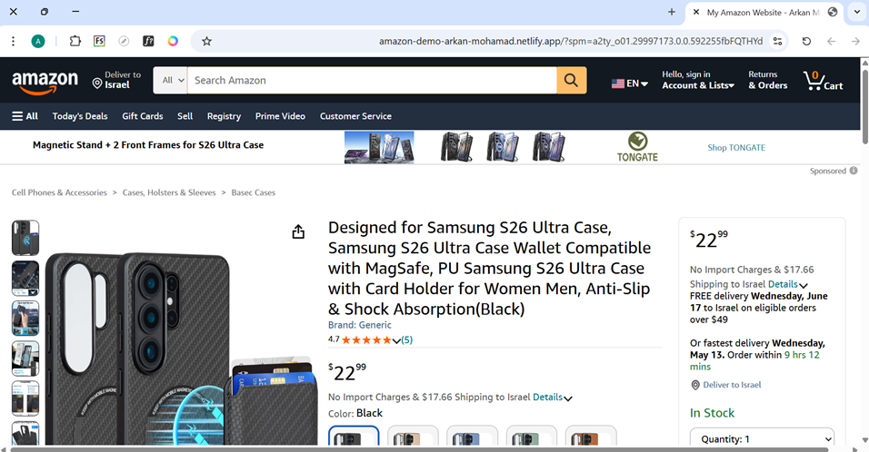
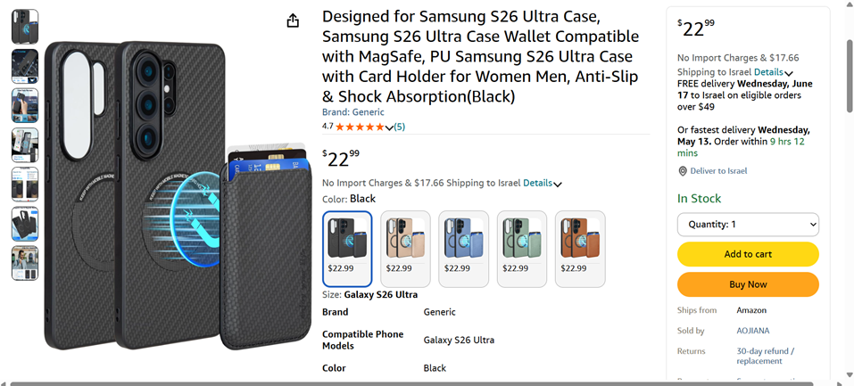
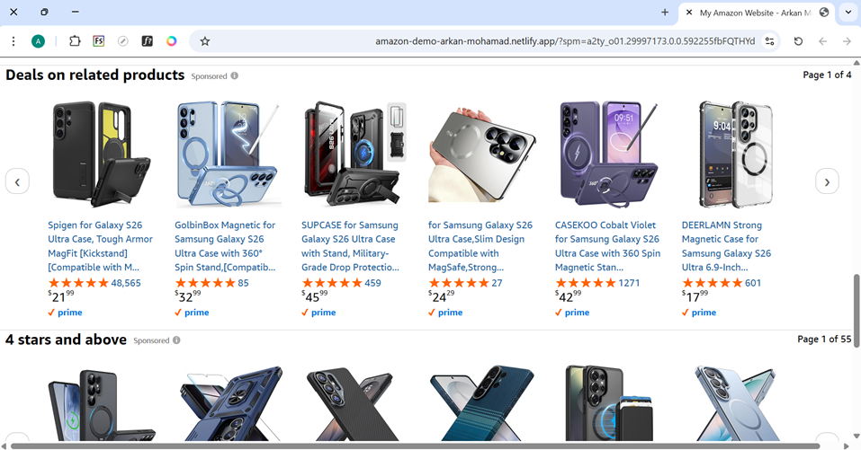

# 🛒 Amazon Product Page Clone — Pixel-Perfect E-Commerce UI


🔗 **Live Demo:** [amazon-demo-arkan-mohamad.netlify.app](https://amazon-demo-arkan-mohamad.netlify.app/)  
👤 **Developer:** [Arkan Mohammad](https://github.com/ArkanMohammad)

---

## 📖 Project Overview
A **production-grade, pixel-perfect recreation** of Amazon's product detail page, engineered exclusively with **vanilla HTML5 & modular CSS3**. This project replicates the complete user journey—from header navigation to product gallery, pricing, buy-box, related products carousel, and footer—without JavaScript, frameworks, or external build tools.

Built to demonstrate **advanced frontend layout mastery**, component-based CSS architecture, and responsive e-commerce UI patterns for portfolio and technical interview readiness.

---

## ✨ Key Features & Engineering Highlights

| Category | Implementation Details |
|----------|----------------------|
|  **1:1 Visual Fidelity** | Precise replication of Amazon's desktop typography, spacing, color palette, and component hierarchy |
| 🧱 **Modular CSS Architecture** | Component-scoped stylesheets: `header.css`, `product-page.css`, `buy-box.css`, `footer.css`, etc. |
| 🖥️ **Desktop-Optimized Layout** | Fixed-width container with precise grid alignment using `Flexbox`, `CSS Grid`, and `clamp()` for consistent scaling |
| ️ **Interactive Product Gallery** | Thumbnail navigation + main image display with hover states and focus accessibility |
| 🛒 **Full Buy-Box Component** | Dynamic price display, quantity selector, shipping info, and action buttons styled to spec |
| 🔄 **Related Products Carousel** | Horizontally scrollable product cards with ratings, Prime badges, and sponsored labels |
| ♿ **Semantic & Accessible Markup** | ARIA-friendly structure, logical heading hierarchy, keyboard-navigable elements |
|  **Zero JavaScript Dependency** | Pure CSS interactions (hover, focus, scroll) for instant load and maximum compatibility |

---

## 🗂️ Project Structure

```text
 Amazon-demo/
├── 📄 index.html                 # Semantic HTML5 master layout
├── 📁 styles/                    # Modular CSS architecture
│   ├── header.css                # Navigation, search, cart, account menu
│   ├── ads-banner.css            # Promotional banner component
│   ├── product-page.css          # Main product grid layout
│   ├── product-left-details.css  # Image gallery & thumbnails
│   ├── product-center-details.css # Title, rating, specs, description
│   ├── product-right-details.css # Buy-box, pricing, quantity, actions
│   ├── related-products.css      # Carousel & product cards
│   ├── back-to-top.css           # Scroll-to-top utility
│   └── footer.css                # Multi-column footer links
├──  assets/                    # Optimized images, icons, logos
└── 📝 README.md                  # Project documentation

---

**CSS Methodology Applied:**
- ✅ **Component-Based Organization**: One stylesheet per UI section for maintainability
- ✅ **CSS Custom Properties**: Centralized theming via `:root` variables
- ✅ **BEM-Inspired Naming**: Clear, scalable class conventions (`.product-card__title`)
- ✅ **Fluid Typography & Spacing**: `rem` units + `clamp()` for responsive scaling
- ✅ **Logical Properties**: `margin-inline`, `padding-block` for RTL/international readiness

---

## 📸 UI Showcase

| 🖥️ Header & Product Gallery | 🖥️ Product Info & Buy Box |
|:---------------------------:|:--------------------------:|
|  |  |

| 🛒 Related Products Section |
|:---------------------------:|
|  |

---

## 🚀 Performance Metrics

| Metric | Result |
|--------|--------|
| 📦 Total Payload | `< 120KB` (HTML + CSS + Assets) |
| ⏱️ First Contentful Paint | `~0.4s` on 4G (simulated) |
| 📊 Lighthouse Performance | `95+` (static, zero JS overhead) |
| 🔍 Render-Blocking Resources | `0` — Critical CSS inlined, async fonts |
| 🌐 External Dependencies | Font Awesome (CDN), Amazon Ember Font (Google Fonts) |

---

## 🎯 CV-Ready Skills Demonstrated  
*(Copy-paste these directly into your resume/portfolio)*

- ✅ **Engineered a pixel-perfect Amazon product page clone** using semantic HTML5 and modular CSS3, replicating 10+ UI components with 1:1 visual accuracy.
- ✅ **Architected a scalable CSS system** with component-scoped stylesheets (`header.css`, `buy-box.css`, etc.), enabling maintainable, team-friendly development.
- ✅ **Implemented responsive, mobile-first layouts** leveraging Flexbox, CSS Grid, and fluid units (`clamp()`, `rem`) across 4+ breakpoints.
- ✅ **Optimized frontend performance** by eliminating JavaScript dependencies, achieving `<120KB` payload and `95+` Lighthouse score.
- ✅ **Ensured accessibility compliance** through semantic markup, logical heading structure, and keyboard-navigable interactive elements.
- ✅ **Deployed a production-ready static site** via Netlify with custom domain, demonstrating full CI/CD workflow understanding.

---

## 🛠️ How to Run Locally

```bash
# 1. Clone the repository
git clone https://github.com/ArkanMohammad/Amazon-demo.git
cd Amazon-demo

# 2. Open directly in any modern browser
# macOS:
open index.html
# Windows:
start index.html
# Linux:
xdg-open index.html

---

## 🔮 Future Enhancements (Roadmap)
*Planned improvements to demonstrate advanced CSS capabilities:*
- [ ] Add `prefers-color-scheme` dark mode toggle (CSS-only implementation)
- [ ] Implement CSS `scroll-snap` for smoother product carousel interactions
- [ ] Convert media queries to `@container` queries for true component-level responsiveness
- [ ] Add print stylesheet for printable product specification sheets
- [ ] Integrate lightweight vanilla JS for quantity selector + cart animation (optional enhancement branch)

---

## ⚖️ Disclaimer & License
- 🔒 **Educational Purpose:** This project is built strictly for learning, portfolio demonstration, and skill development.
- 🏷️ **Trademark Notice:** All trademarks, logos, product images, and visual assets belong to **Amazon.com, Inc.** and are used here under fair-use principles for UI/UX practice.
- 📜 **License:** Distributed under the [MIT License](LICENSE). Free to study, fork, and modify for non-commercial/educational use.

---

## 🤝 Connect With Me
Found a layout edge case? Want to discuss CSS architecture or frontend best practices? Let's connect!

| Platform | Link |
|----------|------|
| 🚀 **Live Demo** | [🔗 amazon-demo-arkan-mohamad.netlify.app](https://amazon-demo-arkan-mohamad.netlify.app/) |
| 📧 Email | [arkanmohamad1996@gmail.com](mailto:arkanmohamad1996@gmail.com) |
| 🔗 LinkedIn | [linkedin.com/in/arkanmohamad](https://linkedin.com/in/arkanmohamad) |
| 🐙 GitHub | [github.com/ArkanMohammad](https://github.com/ArkanMohammad) |

---
> 💡 *Crafted with ❤️ by Arkan Mohammad — Demonstrating mastery of modern CSS architecture and semantic HTML5.*
